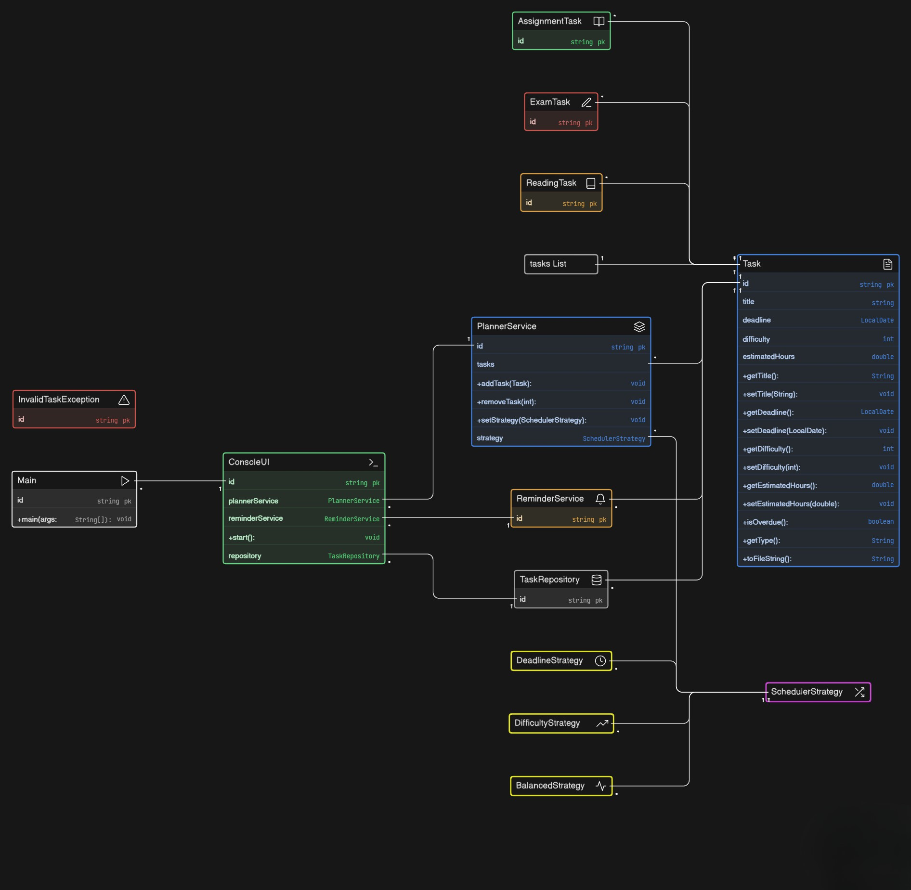

# PCCCS495 – Term II Project

## Project Title
Smart Study Planner using Strategy and Observer Pattern

---

## Problem Statement
This project implements a Smart Study Planner that helps students manage academic tasks efficiently through dynamic scheduling techniques. The system addresses the common problem of poor task prioritization and lack of structured planning by introducing multiple scheduling strategies based on deadlines, difficulty, and estimated effort.

The application follows an object-oriented and modular design to ensure maintainability, flexibility, and extensibility. It incorporates design patterns to allow dynamic behavior and improved separation of concerns.

---

## Target User

### Primary Users
- College students managing multiple academic tasks  
- Individuals seeking structured study planning  

### Secondary Users
- Students learning Object-Oriented Programming  
- Developers exploring design patterns and layered architecture  

---

## Core Features

### Task Management
- Add, view, and remove tasks  
- Multiple task types: Assignment, Exam, Reading  

### Scheduling System
- Dynamic scheduling using multiple strategies  
- Deadline-based prioritization  
- Difficulty-based prioritization  
- Balanced strategy combining multiple factors  
- Runtime switching of strategies  

### Reminder System
- Identification of overdue tasks  
- Alerts for upcoming deadlines  

### Data Persistence
- File-based storage using text file  
- Automatic loading of saved tasks  
- Data retained across executions  

### Input Validation
- Numeric validation for inputs  
- Date format validation  
- Controlled error handling using exceptions  

---

## Object-Oriented Programming Concepts Implemented

### Abstraction
- Abstract class `Task` defines common structure for all tasks  

### Inheritance
- Specialized classes extend base task:
  - AssignmentTask  
  - ExamTask  
  - ReadingTask  

### Polymorphism
- Strategy interface enables dynamic scheduling behavior  

### Encapsulation
- Task data is private and accessed via getter/setter methods  

### Exception Handling
- Input validation and runtime error handling using try-catch  

---

## Architecture Overview

The system follows a layered architecture:

- UI Layer: Handles user interaction  
- Service Layer: Manages core business logic  
- Strategy Layer: Defines scheduling algorithms  
- Model Layer: Represents task entities  
- Repository Layer: Handles file storage  

---

## Project Structure

## Project Structure

```
SmartStudyPlanner/
│
├── data/
│   └── tasks.txt
│
└── src/
    └── planner/
        ├── Main.java
        │
        ├── model/
        │   ├── Task.java
        │   ├── AssignmentTask.java
        │   ├── ExamTask.java
        │   └── ReadingTask.java
        │
        ├── strategy/
        │   ├── SchedulerStrategy.java
        │   ├── DeadlineStrategy.java
        │   ├── DifficultyStrategy.java
        │   └── BalancedStrategy.java
        │
        ├── service/
        │   ├── PlannerService.java
        │   └── ReminderService.java
        │
        ├── repository/
        │   └── TaskRepository.java
        │
        ├── ui/
        │   └── ConsoleUI.java
        │
        └── exception/
            └── InvalidTaskException.java
```
## UML Diagram



## Technical Stack

### Language & Runtime
- Java (JDK 11 compatible)

### Libraries & APIs
- Collections: ArrayList, List  
- Date Handling: LocalDate  
- File I/O: BufferedReader, BufferedWriter  
- Input Handling: Scanner  

---

## Execution Instructions

### Using Command Line

1. Navigate to project root directory

2. Compile the project:

```
    javac -d out -sourcepath src\SmartStudyPlanner\src src\SmartStudyPlanner\src\planner\Main.java
```
3. Run the application:

```
    java -cp out planner.Main
```

## Git Discipline & Development

- Incremental commits for each feature  
- Meaningful commit messages  
- Logical progression of development  
- Minimum 10 commits maintained  
